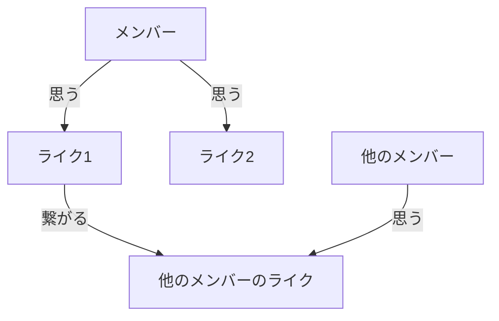

# 概要
好きを繋げるアプリケーション。

つぎの思想に基づく。

- 好きなモノ・コト・トキを語れる。
- 好きを自然に繋げる。
- 嫌いを遠ざける。

人と人が繋がる世界ではなく、好きなものを媒介として繋がる世界をつくる。人による垣根を設けないことでその広がりを自然の成り行きに任せる。批判や批評はこの世界で負の感情によるスパイラルを産むため繋がりを断つようにする。

# システム関連図

