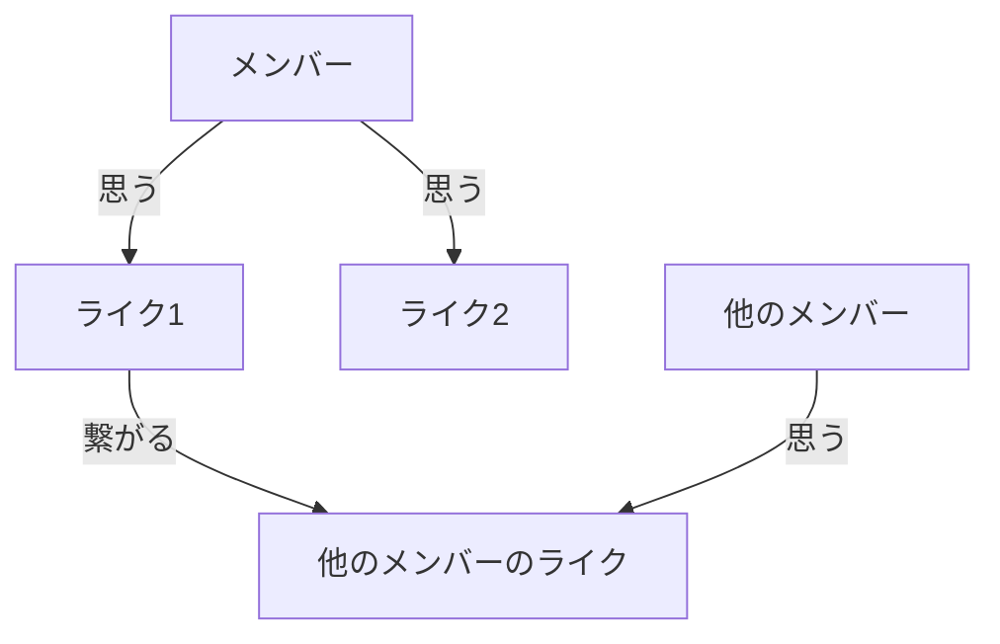

# システム関連図

```mermaid
graph
  like1[ライク1] -- 繋がる --> other_like
  like2[ライク2]
  member[メンバー] -- 思う --> like1
  member[メンバー] -- 思う --> like2
  other_like[他のメンバーのライク]
  other_member[他のメンバー] -- 思う --> other_like
```
